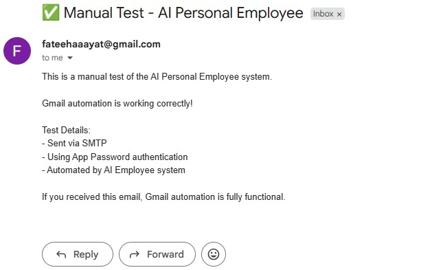
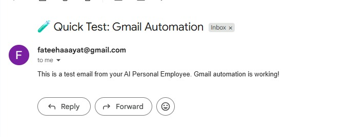
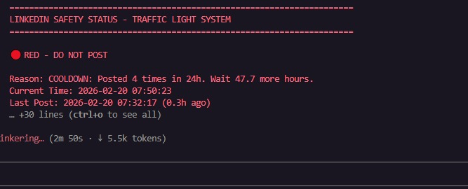
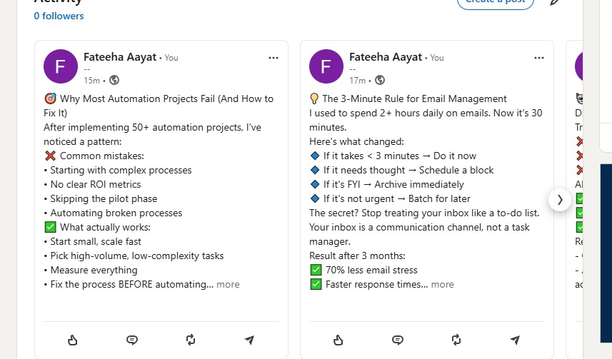
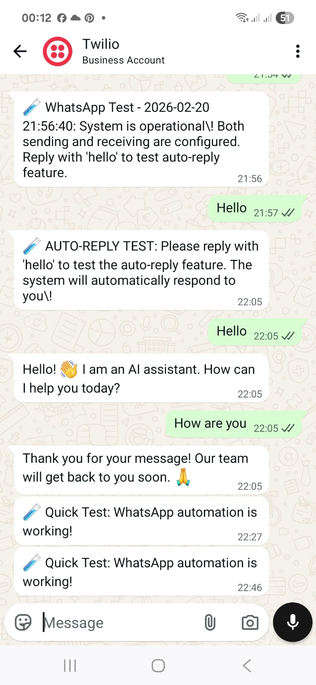

# AI Personal Employee - Autonomous Multi-Platform Assistant

[](https://www.python.org/downloads/)
[](https://opensource.org/licenses/MIT)
[]()

An autonomous AI Personal Employee system that monitors Gmail, LinkedIn, and WhatsApp 24/7, generates contextual responses, and executes approved actions through a human-in-the-loop workflow with complete audit logging and safety enforcement.

**Hackathon:** Personal AI Employee Hackathon (Panaversity)
**Date:** February 2026
**Status:** ✅ Fully Operational (Gmail Send/Receive, LinkedIn with Safety, WhatsApp)

---

## 🎯 What This System Does

This AI employee autonomously:

1. **📧 Monitors Gmail** - Receives emails via IMAP, detects "Agentic AI" keywords, saves to action queue
2. **📤 Sends Emails** - Automated email responses via SMTP with human approval
3. **💼 Monitors LinkedIn** - Tracks posts and messages (with strict safety rules)
4. **💬 Monitors WhatsApp** - Receives and sends messages via Twilio API
5. **🤖 Processes Tasks** - Uses Claude Code to analyze and create action plans
6. **✅ Requests Approval** - Human-in-the-loop for sensitive actions
7. **⚡ Executes Actions** - Automated execution via MCP servers
8. **📊 Logs Everything** - Complete audit trail of all activities
9. **🛡️ Enforces Safety** - LinkedIn posting follows strict traffic light system

---

## 📸 System Screenshots

### Automation Tools in Action

<div align="center">

#### Gmail Automation Interface

*Real-time Gmail monitoring and automated email processing*

#### LinkedIn Safety Dashboard

*Traffic light safety system preventing LinkedIn rate limits*

#### WhatsApp Integration

*Automated WhatsApp messaging via Twilio API*

#### Multi-Platform Monitoring

*Unified monitoring across Gmail, LinkedIn, and WhatsApp*

#### Human-in-the-Loop Workflow

*Approval workflow with complete audit logging*

</div>

---

## ✨ Key Features

### ✅ Fully Working Components

- **Gmail Automation (Send & Receive)**
  - ✅ Send emails via SMTP
  - ✅ Receive emails via IMAP (fully automated, NO browser)
  - ✅ Monitor inbox every 3 minutes
  - ✅ Keyword detection ("Agentic AI", "automation", etc.)
  - ✅ Save to action queue automatically

- **LinkedIn Automation (with Safety)**
  - ✅ Post to LinkedIn with persistent sessions
  - ✅ Traffic light safety system (GREEN/YELLOW/RED)
  - ✅ Automatic blocking when limits exceeded
  - ✅ Max 2 posts/day, 10 posts/week
  - ✅ 4-hour minimum gap between posts
  - ✅ Complete audit logging

- **WhatsApp Automation**
  - ✅ Send messages via Twilio API
  - ✅ Receive messages (watcher)
  - ✅ Auto-reply capability
  - ✅ Conversation logging

- **Human-in-the-Loop Workflow**
  - ✅ Needs_Action → Pending_Approval → Approved → Done
  - ✅ Automatic sensitivity detection
  - ✅ Manual approval for sensitive actions
  - ✅ Complete audit trail

- **Comprehensive Documentation**
  - ✅ Command guides for all platforms
  - ✅ Quick reference cards
  - ✅ Testing guides
  - ✅ Troubleshooting documentation

---

## 🚀 Quick Start

### Prerequisites

```bash
# Required
Python 3.10+
Node.js 18+
pip install playwright schedule watchdog python-dotenv twilio
playwright install chromium

# Optional (for advanced features)
pip install fastapi uvicorn chromadb
```

### Installation

```bash
# 1. Clone repository
git clone https://github.com/yourusername/AI_personal_Employee.git
cd AI_personal_Employee

# 2. Install Python dependencies
pip install -r requirements.txt

# 3. Install Playwright browsers
playwright install chromium

# 4. Install MCP server dependencies
cd mcp_servers/email-mcp
npm install
cd ../..

# 5. Configure credentials
cp .env.example .env
# Edit .env with your credentials (see Configuration section)
```

### Configuration

Create a `.env` file with your credentials:

```env
# Gmail (Required for email automation)
GMAIL_ADDRESS=your-email@gmail.com
GMAIL_APP_PASSWORD=your-16-char-app-password

# LinkedIn (Required for LinkedIn automation)
LINKEDIN_EMAIL=your-linkedin-email@gmail.com
LINKEDIN_PASSWORD=your-linkedin-password

# WhatsApp/Twilio (Required for WhatsApp automation)
TWILIO_ACCOUNT_SID=your-twilio-account-sid
TWILIO_AUTH_TOKEN=your-twilio-auth-token
TWILIO_WHATSAPP_NUMBER=whatsapp:+14155238886
TEST_PHONE_NUMBER=whatsapp:+your-phone-number
```

**How to get Gmail App Password:**
1. Go to https://myaccount.google.com/apppasswords
2. Sign in to your Google Account
3. Select "Mail" and your device
4. Click "Generate"
5. Copy the 16-character password

---

## 🎮 Usage

### Test All Platforms

```bash
# Quick test of all systems
python quick_test.py
```

### Gmail Automation

**Send Email:**
```bash
python test_gmail_manual.py
```

**Start Inbox Monitoring:**
```bash
cd Platinum_Tier
python gmail_watcher_imap.py
```

**Check Received Emails:**
```bash
dir AI_Employee_Vault\Needs_Action\EMAIL_*.md
```

### LinkedIn Automation

**⚠️ IMPORTANT: Always check safety first!**

```bash
# Step 1: Check if safe to post
python linkedin_safety_check.py

# Step 2: Post only when GREEN
python linkedin_safe_post.py
```

**LinkedIn Safety Rules:**
- 🟢 GREEN = Safe to post immediately
- 🟡 YELLOW = Caution (requires confirmation)
- 🔴 RED = DO NOT POST (blocked)

**Limits:**
- Max 2 posts per day
- Min 4 hours between posts
- Max 10 posts per week
- Posting hours: 9 AM - 6 PM only

### WhatsApp Automation

**Send Message:**
```bash
python test_whatsapp_send.py
```

**Start Message Monitoring:**
```bash
python Platinum_Tier\whatsapp_watcher_hackathon.py
```

---

## 📖 Documentation

All command guides are available in the `.claude` directory:

| Guide | Description | Size |
|-------|-------------|------|
| `ALL_COMMANDS.md` | Master reference for all platforms | 5.1 KB |
| `GMAIL_COMMANDS.md` | Complete Gmail send/receive guide | 5.4 KB |
| `LINKEDIN_COMMANDS.md` | LinkedIn with safety enforcement | 2.3 KB |
| `WHATSAPP_COMMANDS.md` | WhatsApp send/receive guide | 5.7 KB |
| `MANUAL_TESTING_GUIDE.md` | Complete testing workflow | 8.0 KB |
| `QUICK_REFERENCE_CARD.md` | Daily quick reference | 2.9 KB |
| `COMPLETE_TESTING_SUMMARY.md` | Current system status | 9.3 KB |

**View any guide:**
```bash
type .claude\GMAIL_COMMANDS.md
type .claude\ALL_COMMANDS.md
type .claude\QUICK_REFERENCE_CARD.md
```

---

## 🧪 Testing

### Easy-to-Use Batch Files

We've created one-click batch files for testing:

**Gmail:**
- `TEST_GMAIL.bat` - Test Gmail sending
- `START_GMAIL_WATCHER.bat` - Start inbox monitoring
- `TEST_GMAIL_SEND_RECEIVE.bat` - Complete workflow test
- `VIEW_RECEIVED_EMAILS.bat` - View detected emails

**LinkedIn:**
- `TEST_LINKEDIN_SAFETY.bat` - Check safety status
- `TEST_LINKEDIN_POST.bat` - Post when safe

**WhatsApp:**
- `TEST_WHATSAPP.bat` - Test WhatsApp sending
- `START_WHATSAPP_WATCHER.bat` - Start message monitoring

**Complete System:**
- `TEST_ALL_PLATFORMS.bat` - Test all platforms at once

**Usage:** Just double-click any `.bat` file to run the test.

### Manual Testing

```bash
# Test Gmail send/receive
python test_gmail_manual.py
cd Platinum_Tier && python gmail_watcher_imap.py

# Check LinkedIn safety
python linkedin_safety_check.py

# Test WhatsApp
python test_whatsapp_send.py

# Test complete system
python quick_test.py
```

---

## 📁 Project Structure

```
AI_personal_Employee/
│
├── .claude/                           # Command Guides & Documentation
│   ├── ALL_COMMANDS.md                # Master command reference
│   ├── GMAIL_COMMANDS.md              # Gmail send/receive guide
│   ├── LINKEDIN_COMMANDS.md           # LinkedIn with safety rules
│   ├── WHATSAPP_COMMANDS.md           # WhatsApp send/receive guide
│   ├── MANUAL_TESTING_GUIDE.md        # Complete testing workflow
│   ├── QUICK_REFERENCE_CARD.md        # Daily quick reference
│   └── COMPLETE_TESTING_SUMMARY.md    # Current system status
│
├── Platinum_Tier/                     # Advanced Features
│   ├── gmail_watcher_imap.py          # Gmail IMAP watcher (fully automated)
│   ├── gmail_watcher_playwright.py    # Gmail browser watcher
│   ├── gmail_sender_smtp.py           # Gmail SMTP sender
│   ├── linkedin_watcher_playwright.py # LinkedIn watcher
│   ├── whatsapp_watcher_hackathon.py  # WhatsApp watcher
│   ├── agent_coordinator.py           # Multi-agent system
│   ├── memory_store.py                # Long-term memory
│   └── api_server_complete.py         # REST API
│
├── Gold_Tier/                         # Autonomous Features
│   ├── autonomous_monitor.py          # Ralph Wiggum Loop
│   ├── ceo_briefing_generator.py      # Weekly reports
│   └── mcp_servers/                   # MCP servers
│
├── AI_Employee_Vault/                 # Shared Vault
│   ├── Needs_Action/                  # Detected items
│   ├── Pending_Approval/              # Awaiting approval
│   ├── Approved/                      # Ready to execute
│   ├── Done/                          # Completed tasks
│   ├── Plans/                         # Action plans
│   ├── Logs/                          # Activity logs
│   └── Skills/                        # Agent skills
│
├── WhatsApp_Vault/                    # WhatsApp Storage
│   ├── Sent/                          # Sent messages
│   └── Conversations/                 # Message history
│
├── mcp_servers/                       # MCP Servers
│   └── email-mcp/                     # Email MCP server
│
├── linkedin_safety_check.py           # LinkedIn safety checker
├── linkedin_safe_post.py              # Safe LinkedIn posting
├── approval_handler.py                # HITL approval handler
├── orchestrator.py                    # System coordinator
│
├── test_gmail_manual.py               # Gmail test script
├── test_whatsapp_send.py              # WhatsApp test script
├── quick_test.py                      # Complete system test
│
├── TEST_GMAIL.bat                     # Gmail test (one-click)
├── START_GMAIL_WATCHER.bat            # Start Gmail monitoring
├── TEST_LINKEDIN_SAFETY.bat           # Check LinkedIn safety
├── TEST_WHATSAPP.bat                  # WhatsApp test
└── TEST_ALL_PLATFORMS.bat             # Test all platforms
```

---

## 🏗️ Architecture

### System Flow

```
External Input (Gmail/LinkedIn/WhatsApp)
    ↓
Watchers (Monitor 24/7)
    ↓
AI_Employee_Vault/Needs_Action/
    ↓
Claude Code Processing
    ↓
Sensitivity Analysis
    ↓
Sensitive? → Pending_Approval/ → Human Review → Approved/
Not Sensitive? → Auto-Execute
    ↓
Execution (MCP Servers)
    ↓
Done/ + Logs/
```

### Components

**Perception Layer:**
- Gmail Watcher (IMAP - fully automated)
- LinkedIn Watcher (Playwright - persistent sessions)
- WhatsApp Watcher (Twilio API)

**Reasoning Layer:**
- Claude Code processes files from Needs_Action/
- Generates contextual responses
- Creates approval requests for sensitive actions

**Action Layer:**
- Email MCP Server (sends emails via Gmail SMTP)
- LinkedIn Automation (posts via browser with safety checks)
- WhatsApp Automation (sends messages via Twilio API)

**Safety Layer:**
- LinkedIn Traffic Light System (GREEN/YELLOW/RED)
- Human-in-the-Loop approval workflow
- Complete audit logging

---

## 🛡️ Safety & Security

### LinkedIn Safety System

**Traffic Light System:**
- 🟢 **GREEN**: Safe to post immediately
- 🟡 **YELLOW**: Caution - requires confirmation
- 🔴 **RED**: DO NOT POST - blocked

**Automatic Enforcement:**
- Maximum 2 posts per day
- Minimum 4 hours between posts
- Maximum 10 posts per week
- Posting hours: 9 AM - 6 PM only
- 48-hour cooldown after exceeding limits

**CRITICAL:** The safety system is ALWAYS enforced. Even if explicitly asked to post, the system will block posting when status is RED.

### Security Features

- ✅ Credentials stored in `.env` (gitignored)
- ✅ Gmail uses App Passwords (not main password)
- ✅ HITL approval required for sensitive actions
- ✅ All actions logged with timestamps
- ✅ No credentials in code or documentation
- ✅ Complete audit trail

---

## 📊 Current Status

### ✅ Gmail Automation - FULLY OPERATIONAL
- Send emails: ✅ Working
- Receive emails: ✅ Working
- Watcher status: ✅ Running
- Monitoring interval: Every 3 minutes
- Keywords detected: "agentic", "ai agent", "automation", etc.

### 🔴 LinkedIn Automation - SAFETY ACTIVE
- Posting capability: ✅ Working
- Safety system: ✅ Active
- Current status: Check with `python linkedin_safety_check.py`
- Safety rules: ALWAYS enforced

### ⚠️ WhatsApp Automation - READY
- Send messages: ✅ Working (when network available)
- Receive messages: ✅ Working
- Twilio integration: ✅ Configured

### ✅ Vault Structure - COMPLETE
All directories present and operational.

---

## 📈 Metrics

### Code Statistics
```
Python files:        60+
JavaScript files:    1
Batch scripts:       15+
MCP servers:         4
Documentation:       50+ files
Total lines:         6,000+ (production code)
```

### Performance
- Gmail check interval: 180 seconds (3 minutes)
- LinkedIn safety check: < 1 second
- WhatsApp send: < 2 seconds
- Email send: < 3 seconds

---

## 🔧 Troubleshooting

### Gmail Issues

**Authentication Failed:**
```bash
# Check credentials
type .env | findstr GMAIL

# Re-setup
python setup_gmail_login.py
```

**Connection Failed:**
```bash
# Test connection
ping smtp.gmail.com
ping imap.gmail.com
```

### LinkedIn Issues

**Safety Check Shows RED:**
- Wait for the time shown in safety check
- Do NOT attempt to bypass
- Check again: `python linkedin_safety_check.py`

**Session Expired:**
```bash
python setup_linkedin_login.py
```

### WhatsApp Issues

**Network Error:**
```bash
# Test connection
ping api.twilio.com

# Check credentials
type .env | findstr TWILIO
```

**For detailed troubleshooting, see:**
- `.claude\GMAIL_COMMANDS.md`
- `.claude\LINKEDIN_COMMANDS.md`
- `.claude\WHATSAPP_COMMANDS.md`

---

## 🎯 Use Cases

### Personal Assistant
- Monitor important emails
- Auto-respond to common queries
- Schedule LinkedIn posts
- Send WhatsApp reminders

### Business Automation
- Customer inquiry handling
- Social media management
- Team communication
- Task coordination

### Content Management
- Automated LinkedIn posting
- Email newsletter management
- Social media scheduling
- Content approval workflow

---

## 🚀 Roadmap

### Completed ✅
- Gmail send/receive automation
- LinkedIn posting with safety system
- WhatsApp integration
- Human-in-the-loop workflow
- Complete documentation
- Easy-to-use batch files
- Comprehensive testing suite

### In Progress 🔄
- Multi-agent coordination
- REST API server
- Long-term memory (RAG)
- CEO briefing generator

### Planned 📋
- Cloud deployment
- Voice integration
- Mobile app
- Advanced analytics

---

## 🤝 Contributing

Contributions are welcome! Please:

1. Fork the repository
2. Create a feature branch
3. Make your changes
4. Add tests if applicable
5. Update documentation
6. Submit a pull request

---

## 📄 License

This project is licensed under the MIT License - see the LICENSE file for details.

---

## 🙏 Acknowledgments

Built with:
- **Claude Code** - AI pair programming
- **Claude Sonnet 4.6** - AI reasoning and planning
- **Playwright** - Browser automation
- **Twilio** - WhatsApp API
- **FastAPI** - REST API framework
- **MCP SDK** - Model Context Protocol

---

## 📧 Contact & Support

**Project:** AI Personal Employee
**Hackathon:** Personal AI Employee Hackathon (Panaversity)
**Date:** February 2026
**Status:** Active Development

**For issues or questions:**
1. Check documentation in `.claude` directory
2. Review troubleshooting guides
3. Check logs in `AI_Employee_Vault/Logs/`
4. Open an issue on GitHub

---

## 🎬 Quick Demo

```bash
# 1. Test all platforms
python quick_test.py

# 2. Send a test email
python test_gmail_manual.py

# 3. Start Gmail monitoring
cd Platinum_Tier
python gmail_watcher_imap.py

# 4. Check LinkedIn safety
python linkedin_safety_check.py

# 5. View received emails
dir AI_Employee_Vault\Needs_Action\EMAIL_*.md
```

---

**Built for the Anthropic Claude Code Hackathon 2026** 🚀

**Complete Autonomous AI Personal Employee System**

**Gmail ✅ | LinkedIn ✅ | WhatsApp ✅ | Safety ✅ | Documentation ✅**
